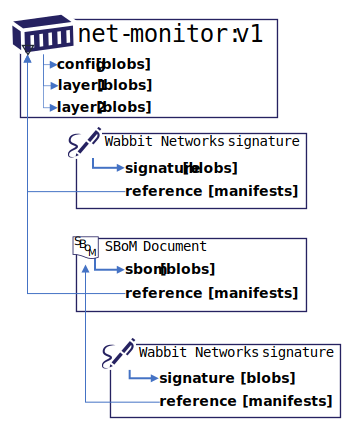

# Detailed Demo Steps

The following demonstrates the underlying details of **prototype-2**.

> At this point, this is a target experience, that is still being developed.

## Demo Setup

Perform the following steps prior to the demo:

- Install [Docker Desktop](https://www.docker.com/products/docker-desktop) for local docker operations
- [Install and Build the nv2 Prerequisites](./README.md#prerequisites)
- Create an empty working directory:
  ```bash
  mkdir nv2-demo
  cd nv2-demo/
  ```
- Generate the Wabbit Networks Public and Private Keys:
  ```bash
  openssl req \
    -x509 \
    -sha256 \
    -nodes \
    -newkey rsa:2048 \
    -days 365 \
    -subj "/CN=registry.wabbit-networks.io/O=wabbit-networks inc/C=US/ST=Washington/L=Seattle" \
    -addext "subjectAltName=DNS:registry.wabbit-networks.io" \
    -keyout ./wabbit-networks.key \
    -out ./wabbit-networks.crt
  ```
- Start a local registry instance:
  ```bash
  # NOTE: the nv2-prototype-2 image does not yet exist
  docker run -d -p 80:5000 --restart always --name registry notaryv2/registry:nv2-prototype-2
  ```
- Add a `etc/hosts` entry to simulate pushing to registry.wabbit-networks.io
  - If running on windows, _even if using wsl_, add the following entry to: `C:\Windows\System32\drivers\etc\hosts`
    ```hosts
    127.0.0.1 registry.wabbit-networks.io
    ```

## Demo Reset

If iterating through the demo, these are the steps required to reset to a clean state:

- Remove docker alias:
  ```bash
  unalias docker
  ```
- Reset the local registry:
  ```bash
  docker rm -f $(docker ps -a -q)
  docker run -d -p 80:5000 --restart always --name registry notaryv2/registry:nv2-prototype-2
  ```
- Remove the `net-monitor:v1` image:
  ```bash
  docker rmi -f registry.wabbit-networks.io/net-monitor:v1
  ```
- Remove `wabbit-networks.crt` from `"verificationCerts"`:
  ```bash
  code ~/.docker/nv2.json
  ```

## The End to End Experience


- Wabbit Networks is a small software company that produces network monitoring software.
- ACME Rockets wishes to acquire network monitoring software.
- ACME Rockets doesn't know about Wabbit Networks, but finds their [net-monitor software in Docker Hub](https://hub.docker.com/r/wabbitnetworks/net-monitor)
- Since they've never heard of Wabbit Networks, they're a little reluctant to run network software without some validations.
- ACME Rockets has a policy to only import Docker Hub certified software, or approved vendors.
- Wabbit Networks works with Docker Hub to get certified, to help with their customer confidence.
- ACME Rockets will only deploy software that's been scanned and approved by the ACME Rockets security team. They know it's been approved because all approved software has been signed by the ACME Rockets security team.

## Wabbit Networks Build, Sign, Promote Process

Let's walk through the sequence of operations Wabbit Networks takes to build, sign and promote their software.

Within the automation of Wabbit Networks, the following steps are completed:

1. Build the container image
1. Sign the container image
1. Create an SBoM
1. Sign the SBoM
1. Push the image, sbom, and the associated signatures to the registry

### Summary of artifacts

The following graph of artifacts will be created and pushed to the registry



- the `net-monitor:v1` image
- a wabbit-networks signature of the `net-monitor:v1` image
- an SBoM for the `net-monitor:v1` image
- a wabbit-networks signature of the `net-monitor:v1 sbom`

### Build the `net-monitor` image

  ```bash
  docker build \
      -t registry.wabbit-networks.io/net-monitor:v1 \
      https://github.com/wabbit-networks/net-monitor.git#main
  ```

### Acquire the private key

- As a best practice, we'll always build on an ephemeral client, with no previous state.
- The ephemeral client will retrieve the private signing key from the companies secured key vault provider.

These specific steps are product/cloud specific, so we'll assume these steps have been completed and we have the required keys.

### Sign and Push

Using the private key, we'll sign the `net-monitor:v1` image. Note, we're signing the image with a registry name that we haven't yet pushed to. This enables offline signing scenarios. This is important as the image will eventually be published on `registry.wabbit-networks.io/`, however their internal staging and promotion process may publish to internal registries before promotion to the public registry.

- Generate an [nv2 signature][nv2-signature], persisted locally as `net-monitor_v1.signature.jwt`

  ```shell
  docker notary --enabled

  docker notary sign \
    --key ./wabbit-networks.key \
    --cert ./wabbit-networks.crt \
    $image
  ```
- view the signature referenced from docker notary sign
  ```bash
  cat <output reference of docker notary sign>
  ```

- Push the container image

  ```bash
  docker push registry.wabbit-networks.io/net-monitor:v1
  ```

## Generate an SBoM

This demo focuses on the signing of additional content, including an SBoM. It doesn't focus on a specific SBoM format. As a result, we'll generate the most basic, and _admittedly_ useless SBoM document:

```bash
echo '{"version": "0.0.0.0", "image": "registry.wabbit-networks.io/net-monitor:v1", "contents": "good"}' > sbom_v1.json
```

## Push the SBoM with ORAS

```bash
  oras push registry.wabbit-networks.io/net-monitor \
      --push-as-digest \
      --artifact-type application/example.sbom.v0 \
      --manifest-type application/vnd.oci.artifact.manifest.v1 \
      --manifests registry.wabbit-networks.io/net-monitor@<net-monitor@sha252:digest> \
      --plain-http \
      ./sbom_v1.json
```

### Push the SBoM with Signing

- For non-container images, we'll use the `nv2` cli to sign and push to a registry.
  ```bash
  nv2 sign \
    --manifests oci://registry.wabbit-networks.io/net-monitor@sha256:1a0a0a89a \
    --push \
    -k ~/.ssh/wabbit-networks.key \
    -o net-monitor_v1-sbom.signature.jwt

  # view the manifest
  cat sbom_v1-manifest.json

  # view the sbom signature
  cat <output from oras notary sign>
  ```

## Pulling Validated Content

To represent a deployed, ephemeral node, we'll pull the `net-monitor:v1` image, validating the signature of the image and the sbom.

### Clear the build content

To simulate another client, we'll clear out the `net-monitor:v1` image and signature, simulating a new environment.

> Note: The public and private keys are maintained, deferring to key management prototypes for how keys should be acquired.

```bash
docker rmi -f registry.wabbit-networks.io/net-monitor:v1
rm *.jwt
rm *.json
```

### Attempt, and fail to pull the image

Simulate a notary enabled client, which doesn't yet have the public keys configured.

- Get the digest for the `net-monitor:v1` image:
  ```bash
  oras discover ... (shiwei magic)

  NET_MONITOR_DIGEST=$(curl -v -H "Accept: application/vnd.docker.distribution.manifest.v2+json" \
      registry.wabbit-networks.io/v2/net-monitor/manifests/v1 2>&1 | \
      grep -i 'Docker-Content-Digest:' | \
      awk '{print $3}')
  ```
- Query for Notary v2 linked artifacts
  ```bash
  curl -v -H "Accept: artifactType=application/vnd.cncf.notary.v2" \
    registry.wabbit-networks.io/v2/_ext/oci-artifacts/v1/net-monitor/manifests/${NET_MONITOR_DIGEST}/links
  NET_MONITOR_SIG_DIGEST=^
  ```
- Retrieve the `net-monitor:v1` notary v2 signature
  ```bash
  oras pull registry.wabbit-networks.io/net-monitor@sha256:${NET_MONITOR_SIG_DIGEST} \
      --plain-http
  ```
- Validate the signature
  ```bash
  nv2 verify \
    -c ./wabbit-networks.crt \
    -f net-monitor_v1.signature.jwt \
    oci://registry.wabbit-networks.io/net-monitor:v1
  ```
  The above validation will fail, as we haven't yet configured notary to find the `wabbit-networks.crt` public key.
- Configure Notary access to the wabbit-networks key
  ```bash
  code ~/.docker/nv2.json
  ```
- Add the path to the cert:
  ```json
  "verificationCerts": [
		"/home/stevelas/nv2-demo/wabbit-networks.crt"
	]
  ```
- Validate the signature
  ```bash
  nv2 verify \
    -c ./wabbit-networks.crt \
    -f net-monitor_v1.signature.jwt \
    oci://registry.wabbit-networks.io/net-monitor:v1
  ```

- Pull the image, as the signature validation succeeded
  ```bash
  docker pull $image
  ```

[docker-generate]:        https://github.com/shizhMSFT/docker-generate
[nv2-signature]:          ../signature/README.md
[oci-image-manifest]:     https://github.com/opencontainers/image-spec/blob/master/manifest.md
[oci-image-index]:        https://github.com/opencontainers/image-spec/blob/master/image-index.md
[oci-artifact-manifest]:  https://github.com/opencontainers/artifacts/blob/3e34f029537052639eed59b469cb6c43706ac3d0/artifact-manifest.md
[oras]:                   https://github.com/deislabs/oras